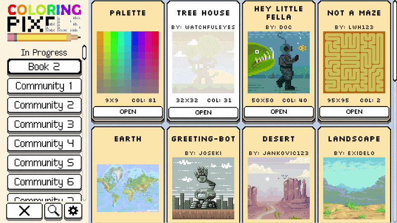

# Coloring Pixels Auto-Filler

A bot that automatically solves levels in the Steam game **Coloring Pixels**. It reads the game's grid data directly from process memory, detects uncolored cells on screen via OpenCV vision, and clicks them with the correct color — no manual clicking required.



---

## Prerequisites

- **Windows 10/11** (the bot uses Win32 API and `pydirectinput`)
- **Steam** with **Coloring Pixels** installed
  - Steam app ID: `897330`
  - Default install path: `C:\Program Files (x86)\Steam\steamapps\common\Coloring Pixels`
- **Python 3.10+**
- A monitor resolution of **1920x1080** (the game should run in fullscreen or windowed borderless at this resolution)

---

## Setup

### 1. Clone the repository

```bash
git clone https://github.com/TobiasStark/ColoringPixelsAutoFiller.git
cd ColoringPixelsAutoFiller
```

### 2. Create and activate a virtual environment

```powershell
python -m venv venv
.\venv\Scripts\Activate.ps1
```

### 3. Install dependencies

```powershell
pip install -r requirements.txt
```

Dependencies: `pymem`, `psutil`, `numpy`, `Pillow`, `mss`, `dnfile`, `pydirectinput`, `opencv-python`, `pytesseract`, `UnityPy`

> **Note:** `pytesseract` also requires the [Tesseract OCR engine](https://github.com/UB-Mannheim/tesseract/wiki) to be installed on your system. However, OCR is only used by some diagnostic scripts and is not required for the core solver.

### 4. Configure game paths

Open `config.py` and verify that `GAME_DIR` points to your Coloring Pixels installation:

```python
GAME_DIR = Path(r"C:\Program Files (x86)\Steam\steamapps\common\Coloring Pixels")
```

If your game is installed elsewhere (e.g. on a different drive), update this path.

### 5. Generate `data/levels.json`

The bot needs a `levels.json` file containing all book/level metadata extracted from the game's asset files. This file is **not included** in the repository (it's ~500 MB).

Generate it by running:

```powershell
python scripts/extract_levels.py
```

This reads `resources.assets` from the game directory and writes `data/levels.json`. You only need to do this once, and again if the game is updated with new levels.

### 6. Generate `data/ui_config.json`

The navigator needs a `data/ui_config.json` file with UI element coordinates for your resolution. A minimal working config looks like:

```json
{
  "sidebar": {
    "sidebar_right": 420,
    "button_left": 20,
    "button_right": 410,
    "scroll_x": 215,
    "book_titles": []
  },
  "level_select": {
    "panel_left": 430,
    "panel_right": 1900,
    "panel_top": 60,
    "panel_bottom": 940,
    "columns": 4,
    "card_width": 340,
    "card_height": 440,
    "gap_x": 20,
    "gap_y": 20,
    "open_offset_x": 170,
    "open_offset_y": 380,
    "row_pitch": 610,
    "scroll_px_per_tick": 100
  },
  "level": {
    "back_button_x": 50,
    "back_button_y": 990
  }
}
```

These values are tuned for **1920x1080 fullscreen**. If you use a different resolution, you will need to adjust them.

---

## Usage

### Launch the game

Start Coloring Pixels via Steam. You can use the included launcher script:

```powershell
python scripts/launch_game.py
```

This launches the game through Steam and auto-clicks the Play button on the configuration dialog. Alternatively, just start the game manually.

### Solve a single level

```powershell
python scripts/solve_level.py "Book 1" 0
```

Arguments:
- **book** — the book's main-menu title (e.g. `"Book 1"`, `"Book 2"`)
- **level** — the 0-based level index inside that book

Options:
- `--no-nav` — skip menu navigation; the level must already be loaded on screen
- `--nav-only` — navigate to the level but don't solve it (useful for testing)

### Solve all levels in all free books

```powershell
python scripts/solve_all.py
```

This iterates through every Free and Bonus book, navigates to each level, and solves it.

Options:
- `--start-book "Book 3"` — resume from a specific book
- `--start-level 5` — resume from a specific level index within the start book
- `--all-books` — also attempt DLC and Reward books (not just Free/Bonus)

### Solve the currently loaded level (no navigation)

If you've already opened a level manually:

```powershell
python scripts/solve_happy.py
```

This skips menu navigation entirely, reads the grid from memory, calibrates vision, and paints all remaining cells.

---

## How It Works

1. **Memory Reading** — `MemoryReader` attaches to `ColoringPixels.exe` and scans the managed heap for the `CrossLevelStorage` Mono object, which holds the `mainGridValues` (target colors) and `savedGridValues` (current progress) arrays.

2. **Vision Calibration** — `Vision` captures the game window via `mss`, detects uncolored (dark) cells using OpenCV contour detection, estimates grid spacing, and matches detected cells against the uncolored pattern from memory to determine the pixel origin of the logical grid.

3. **Navigation** — `Navigator` detects sidebar book buttons and level-card OPEN buttons via contour analysis, clicks them, and verifies the correct level loaded by reading `levelIndex`/`bookIndex` from memory. It auto-corrects if the wrong level opens.

4. **Solving** — `Solver` paints all visible uncolored cells, pans to the next cluster of remaining cells, recalibrates, and repeats until the level is complete. It handles zoom adjustment, pan capping at screen edges, and stall detection with automatic recalibration.

---

## Aborting

Press **Escape** or **F12** at any time to abort the bot. The `InputController` checks for these keys before every click and pan operation.

---

## Project Structure

```
coloring_pixels_bot/
├── config.py                 # Game paths, memory offsets, key bindings, bot settings
├── requirements.txt          # Python dependencies
├── process/
│   ├── memory_reader.py      # Low-level process memory scanning (pymem + Win32)
│   ├── grid_reader.py        # Read CrossLevelStorage grids from memory
│   ├── vision.py             # OpenCV-based grid cell detection and calibration
│   ├── input_controller.py   # Mouse/keyboard input simulation (pydirectinput + Win32)
│   ├── navigator.py          # Menu navigation (book/level selection)
│   ├── solver.py             # Level solving logic (paint, pan, recalibrate loop)
│   ├── calibrator.py         # Manual calibration via click-and-read-memory
│   ├── coordinates.py        # Simple affine coordinate mapper
│   └── window_manager.py     # Game window locator (FindWindow + GetClientRect)
├── scripts/
│   ├── launch_game.py        # Launch game via Steam and auto-click Play
│   ├── solve_level.py        # Solve a single level (with navigation)
│   ├── solve_all.py          # Solve all levels across all books
│   ├── solve_happy.py        # Solve the currently loaded level (no navigation)
│   ├── extract_levels.py     # Extract level metadata from game assets → levels.json
│   ├── extract_books.py      # Extract book metadata
│   ├── analyze_dll.py        # Inspect Assembly-CSharp.dll
│   ├── scan_grid.py          # Diagnostic: scan and print grid state
│   ├── diag_memory.py        # Diagnostic: memory scan debugging
│   ├── diag_candidates.py    # Diagnostic: vision candidate debugging
│   ├── debug_screenshot.py   # Capture and save a screenshot
│   ├── debug_mb.py           # Debug Mono behaviour objects
│   ├── find_leveldata.py     # Find level data assets
│   ├── find_named_mb.py      # Find named MonoBehaviour objects
│   ├── list_monoscripts.py   # List MonoScript objects in the game
│   └── read_textasset.py     # Read TextAsset objects from game files
├── data/                     # Runtime data (gitignored)
│   ├── levels.json           # Level metadata (generated by extract_levels.py)
│   └── ui_config.json        # UI coordinates for navigation
├── docs/
│   └── all_types.txt         # Reference: Mono type names
└── external/                 # Cloned helper repos (gitignored)
    ├── MonoSharp/            # https://github.com/EricYoong/MonoSharp
    └── mono-external-lib/    # https://github.com/reahly/mono-external-lib
```

---

## Troubleshooting

**"Could not find CrossLevelStorage object"**
- Make sure Coloring Pixels is running and a level is loaded (not just the main menu).
- Verify the process name in `config.py` matches (`ColoringPixels.exe`).

**Vision calibration fails repeatedly**
- Ensure the game runs at 1920x1080. Other resolutions require adjusted `ui_config.json` values.
- Make sure the game window is focused and not obscured by other windows.
- Try zooming out manually before starting the solver — the bot expects cells between 26–90 px on screen.

**Bot clicks the wrong level**
- The navigator auto-corrects using memory reads, but if it fails, try `--nav-only` first to verify navigation works, then run the solver separately with `--no-nav`.

**Wrong cells get painted / un-painting detected**
- This indicates a vision calibration error. The solver will attempt to recalibrate automatically. If it persists, restart the level and the bot.

**`levels.json` not found**
- Run `python scripts/extract_levels.py` to generate it. The file is ~500 MB and is not included in the repository.

**Tesseract not found**
- Only needed by some diagnostic scripts. Install from [UB-Mannheim/tesseract](https://github.com/UB-Mannheim/tesseract/wiki) if you use them.

---

## Required In-Game Settings

The bot is tuned for the following in-game configuration. Open the settings dialog (gear icon on the main menu) and set:

| Setting | Value |
|---|---|
| Lock | Completed Pixels |
| Remove completed colors from palette | true |
| Dark mode | Pixels only |
| Contrast | High (palette + pixels) |
| Font | OpenDyslexic |
| Highlight palette text | true |
| Grayscale unselected numbers | false |
| Keyboard pan speed | x1 |
| Magnifier zoom | x1.5 |
| UI scale | 1.0 |

These settings ensure consistent visual appearance for the OpenCV-based cell detection and correct UI element positions for navigation.

---

## Disclaimer

This bot interacts with game memory and simulates input. It is intended for educational purposes. Use at your own risk.
